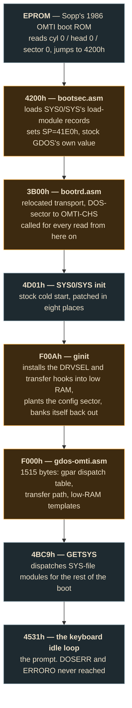

# The machine boots from the hard disk

No floppy attached, no keystrokes.
[`run-hdboottest.sh`](../../src/hd-driver/omti/run-hdboottest.sh) builds the
driver and a fresh image from source, boots the whole machine, and fails
unless all nine criteria below hold.

| | |
| --- | --- |
| **Boot test** | **PASS, 9 of 9** — ends at the keyboard idle loop |
| **Module sequence** | `1C 04 03 04 18 03`, against the floppy reference `00,1C,04,03,04,18` |
| **Floppy activity** | 0 reads, 0 RNF — the FDC is never touched |

## The chain, in the order a boot hits it



Amber is this project's own code; slate is stock GDOS 2.4.

## The nine criteria

| # | Kind | Criterion | Result |
| ---: | --- | --- | --- |
| 1 | floor | `GETSYS` dispatches `1Ch` | seen |
| 2 | stall | no module value repeats more than twice | none |
| 3 | runaway | OMTI operations under 400 | ~320 |
| 4 | isolation | no floppy `READ` | 0 |
| 5 | isolation | no FDC status `91h` (record not found) | 0 |
| 6 | outcome | ends at the idle loop, not `DOSERR` or `ERRORO` | `4531h` |
| 7 | outcome | `DOSERR` and `ERRORO` never fire | never |
| 8 | state | the DOS variables a finished boot leaves | all five |
| 9 | state | the keyboard scan maps `a`–`g` to `61h`–`67h` | `67h` |

### The DOS variables, read at the idle loop

| Address | Name | Reads | Means |
| ---: | --- | :---: | --- |
| `43ABh` | — | `A5h` | the DOS marked itself initialised |
| `4318h` | command line | `0Dh` | a bare CR, not sector-buffer garbage run as an AUTO command |
| `439Fh` | `dndrv` | `0Ah` | the drives `gpar` actually serves |
| `43A0h` | — | `05h` | the boot volume |
| `43A1h` | — | `05h` | the boot volume |

### Both negative controls fire

A test that only ever passes proves nothing. Putting the OVL4 stub back on the
keyboard substitution table fails on `g=00h` with every other criterion still
green; dropping the AUTO-command fix fails at `DOSERR`. Before these nine
criteria existed, this script twice reported a PASS-shaped set of figures for a
boot that never reached the prompt.

## The three that took the longest

### The stack collided with a stock scratch buffer

`bootsec.asm` set `SP=3B00h` — a value sized for its own small load loop, and
only 256 bytes above SYS26/SYS's `3900h`–`3AFFh` scratch. GDOS never
re-establishes its own stack, so it kept running on whatever the loader left.
SYS26's staging copy overwrote a live return address; the next `RET` landed on
**PC=0000h**, a stock `HALT`.

A stock floppy boot of the same disk, at the identical instruction, had
`SP=41D6h` — nowhere near the collision. Fixed by adopting GDOS's own
documented value, `41E0h` (Grosser ch.3 p.3-57), which is within 10 bytes of
that measurement.

### One cause, two symptoms — the AUTO-command GAT re-read

SYS0's cold start re-reads the GAT sector to pick up a possible AUTO command,
from whatever drive is current — drive 0 on a floppy machine. Here the system
volume is drive 5, so the read went out to a floppy that is not attached.

That was **both** the "schlechte Parameter" (`2Fh`) message fired at every boot
with zero keystrokes **and** the one stubborn floppy READ the test had always
reported.

Fixed in 10 bytes, no stub and no `DRVSEL`:

```text
4EF9   JR 4F08h        ; skip the re-read
4F0Dh  LD A,0Dh
       LD (DE),A       ; DE is already 4318h
```

### Lowercase `g` stopped working

A stub planted at `4D06h` in `OVL4/SYS` landed on the source of a 48-byte table
that OVL4 copies to `37A0h` — the keyboard's character-substitution list. The
stub's first byte replaced the table's terminator, and the junk pairs that
appeared included `47h → 00h`. `47h` is `G`.

Unshifted `g` was translated to `00h` and discarded as "no key"; shifted, the
converter adds `20h` before the lookup, misses the table, and works — which is
why only that one letter, and only in lowercase, was affected.

The stub moved to `4D30h`, past the table. The test now asserts the table's own
shape, so a changed layout fails loudly instead of silently eating a character.

## Past the prompt

Typed commands, `DIR`, file copy, the `MEMDISK/CMD` RAM disk and 64/80-column
switching all work. MEMDISK is the sharpest of those: it copies its own
resident driver over `F400h`–`F567h`, which the driver's layout change filled
with `ginit` and `gcfg` — finished code by the time MEMDISK runs, placed there
deliberately so nothing live sits in its way. Confirmed by copying a file to
drive 4 and listing it back.

The scripted test covers the boot, not the prompt; these are checked by running
`./run-calvados.command` and looking.

## Still open

**`BOOT` — not a regression.** The `BOOT` command halts. So does a stock
GDOS 2.4 floppy boot, with none of this port's code involved — measured, not
assumed. `BOOT` is four instructions ending in `JP 0000h`, and re-entering the
ROM needs a full hardware re-init that SYS9 does not do. See
[`known-issues.md`](../development/known-issues.md).

---

Sources: `run-hdboottest.sh` · `bootsec.asm` · `bootrd.asm` · `gdos-omti.asm` ·
[`known-issues.md`](../development/known-issues.md)
